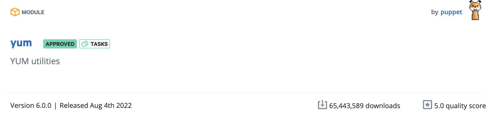

## What does Approved mean?

An approved module means we have checked against a specific criterion, if the module meets the suggested criteria, we do not officially offer support, however it is a module that we would recommend using. For a more extensive write-up on exactly what this means check out our [definition on the Puppet Forge](https://forge.puppet.com/about/approved).

## What does it look like?

When your module is ‘Approved’ it will receive an ‘Approved’ badge on the Puppet Forge.
Here is an example of what an ‘Approved’ module will look like:

## How can I get my module ‘Approved’?

If you feel that your module is actively maintained and meets the guidelines published [here](https://forge.puppet.com/about/approved/criteria) then all you need to do is create an issue in [puppet-approved-modules](https://github.com/puppetlabs/puppet-approved-modules) and one of our team will get around to checking it as soon as they can. They will provide feedback on anything they need to, or award you an ‘Approved’ badge (Yes, it is that simple!).

Catch us on [Slack](https://puppetcommunity.slack.com/archives/C11LCKKQ9) for any further information or questions.
